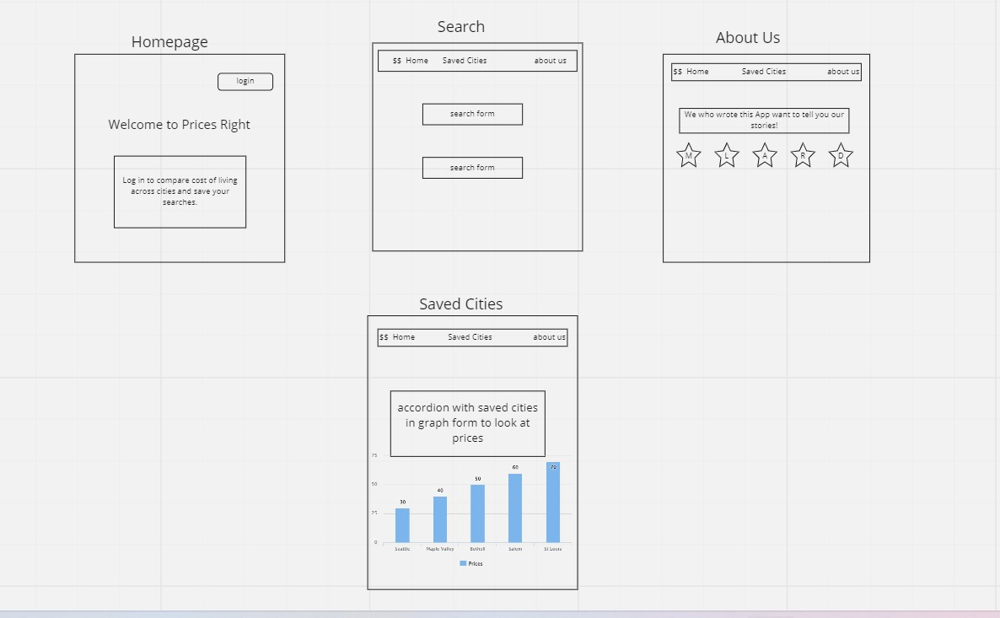

## Software Requirements

### Vision

What is the vision of this product?

Our vision is to allow users to research cost of living indexes for potential areas in the world. Our use cases include young professionals, retirees, and people looking for the best price point in the suburbs can look up housing, gas, and supplies for different areas.

What pain point does this project solve?

This app will put price points into a side by side comparison for any user for free! 

Why should we care about your product?

 Because prices right? But also because it is more convenient and organized data that will help you understand metrics for when you are moving. Moving is one of the most stressful events in a person's life and we want to make sure it is less stressful. 

### Scope (In/Out)

IN - What will your product do
Describe the individual features that your product will do.
High overview of each. Only need to list 4-5:

- allow users to log in and log out
- allow users to research gas prices
- allow users to view cost-of-living dataset
- allow users to save city data and comparisons
- allow users to update and delete saved data

OUT - What will your product not do.

- will not work comprehensively examine all cost-of-living data
- user cannot write new city data
- will not be a published app

These should be features that you will make very clear from the beginning that you will not do during development. These should be limited and very few. Pick your battles wisely. This should only be 1 or 2 things. Example: My website will never turn into an IOS or Android app.
Minimum Viable Product vs

What will your MVP functionality be?

- Gas prices, food cost, living cost.

- Uses at least one api, uses Mongo, auth0

- Front end, back end, CSS framework

What are your stretch goals?

- Taxes, charts, transit api/public transport, safety.?

- Scraping?

Stretch
What stretch goals are you going to aim for?

- Charts

- More api calls

- Taxes?

### Functional Requirements

- A user can create an account
- A user can search for cities to compare cost of living and gas prices
- A user can save, edit and delete searches

## Data Flow

Describe the flow of data in your application. Write out what happens from the time the user begins using the app to the time the user is done with the app. Think about the “Happy Path” of the application. Describe through visuals and text what requests are made, and what data is processed, in addition to any other details about how the user moves through the site.

1. User enters the site and has the option to login
2. User has the option to search for cities to compare data. Calls at least one API and retrieves data base.
3. User has the option to save the retrieved data
4. User has the ability to update and delete
5. User has the option to logout

## Non-Functional Requirements (301 & 401 only)

- Security will be implemented via Auth0.  This will entail the ability for the user to only see their favorites.  The app will implement good user experience (UX) practices with a CSS framework and guide the user on how to use the app.

## Wireframe

